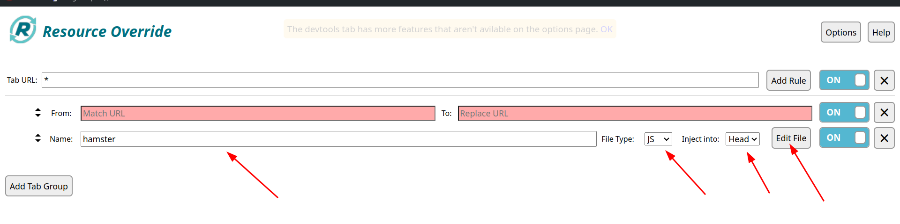
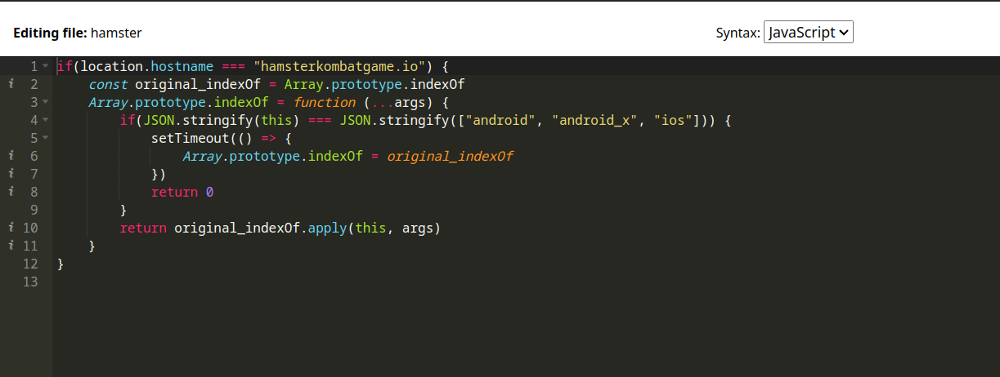
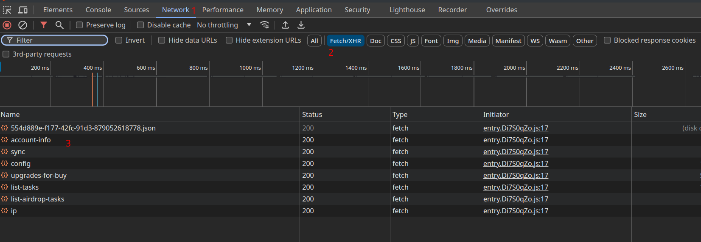
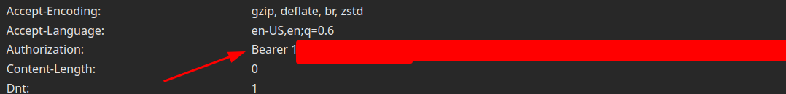

# Гайд как получить токен
### 1. Для начала нужно установить расшерение
 [Resource Override](https://chromewebstore.google.com/detail/resource-override/pkoacgokdfckfpndoffpifphamojphii)


### 2. Установите такие же настройки и нажмите Edit file


### 3. Вставьте этот код:
```js
if(location.hostname === "hamsterkombatgame.io") {
    const original_indexOf = Array.prototype.indexOf
    Array.prototype.indexOf = function (...args) {
        if(JSON.stringify(this) === JSON.stringify(["android", "android_x", "ios"])) {
            setTimeout(() => {
                Array.prototype.indexOf = original_indexOf
            })
            return 0
        }
        return original_indexOf.apply(this, args)
    }
}
```


### 4. Теперь нажминте F12 и откройтке хомяка в браузере


### 5. В одном из запросов найдите токен и полностью скопируйте его


### Затем создайте папку `env` а в ней файл `.env` и вставьте в него токен
```toml
TOKEN="Bearer <То что вы скопировали>"
```